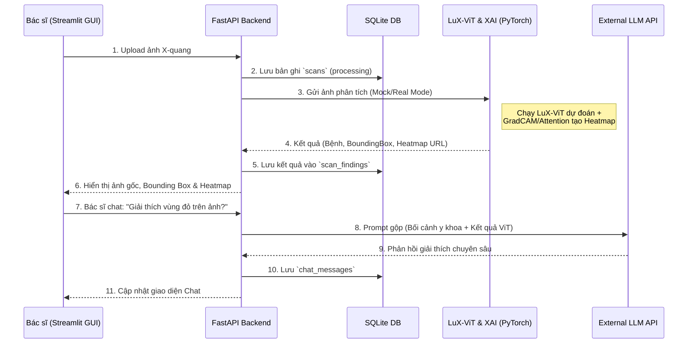

# Kiến trúc Hệ thống MedVision AI

Tài liệu này mô tả chi tiết kiến trúc phần mềm, luồng dữ liệu và các quyết định kỹ thuật của dự án MedVision AI.

## 1. Tổng quan Kiến trúc (High-Level Architecture)

Dự án MedVision AI được thiết kế theo mô hình **Client-Server** với các thành phần chính phân tách rõ ràng:

- **Frontend (Client):** Xây dựng bằng `Streamlit` để cung cấp giao diện người dùng (UI) trực quan cho Bác sĩ (upload ảnh, xem bounding box, xem heatmap, chat với LLM).
- **Backend (Server):** Xây dựng bằng `FastAPI` (Python). Chịu trách nhiệm xử lý API, giao tiếp Database, và điều phối các mô hình AI.
- **Database:** Sử dụng `SQLite` cho môi trường phát triển (MVP), quản lý qua `SQLAlchemy` ORM. Có thể dễ dàng đổi sang `PostgreSQL` trên môi trường Production bằng cách thay đổi chuỗi kết nối (DB_URL).

## 2. Chiến lược xử lý mô hình AI (LuX-ViT & LLM)

Giải quyết bài toán phần cứng (phát triển trên macOS 8GB RAM, triển khai trên PC Windows mạnh):

### 2.1. Computer Vision (LuX-ViT) & XAI (Explainable AI)
Kế thừa trọng số `.pth` của mô hình Vision Transformer. Mô hình không chỉ dự đoán Bệnh lý & Bounding Box, mà còn sử dụng kỹ thuật **GradCAM / Self-Attention** để tạo ra các bản đồ nhiệt (Heatmap) làm nổi bật vùng tổn thương (XAI).

- **Trên macOS (Môi trường Code):** Sử dụng **Mock Mode** (biến môi trường `MOCK_MODEL=True`). Backend sẽ không load PyTorch/Weights thật để tránh tràn RAM, mà sẽ tạo ra dữ liệu giả (random bounding box, fake heatmap) để Frontend có thể phát triển UI.
- **Trên PC Windows (Môi trường Chạy thật):** Load file `.pth` và thực thi infernce thực sự để xuất kết quả bệnh lý, Bounding Box và lưu file ảnh Heatmap.

### 2.2. Chatbot Medical LLM
- Để tránh nặng máy, hệ thống LLM sẽ không chạy Local (trừ khi dùng các bản Llama nhỏ 4-bit). 
- **Giải pháp chính:** Gọi API bên ngoài (OpenAI, Gemini).
- Áp dụng kỹ thuật **System Prompt Engineering** nghiêm ngặt để ép mô hình đóng vai trò là Chuyên gia Y tế, giới hạn câu trả lời trong bối cảnh y khoa (Medical Context Only) và dựa trên thông tin ca X-quang được cung cấp.

## 3. Luồng Dữ liệu (Data Flow Diagram)

## 4. Cấu trúc Schema (Models)
- `Scan`: Thông tin ca chụp và đường dẫn ảnh gốc.
- `ScanFinding`: Thông tin bệnh lý (Confidence Score, JSON Bounding Box) **và thêm trường đường dẫn ảnh Heatmap (XAI)**.
- `ChatMessage`: Lịch sử trò chuyện LLM.
